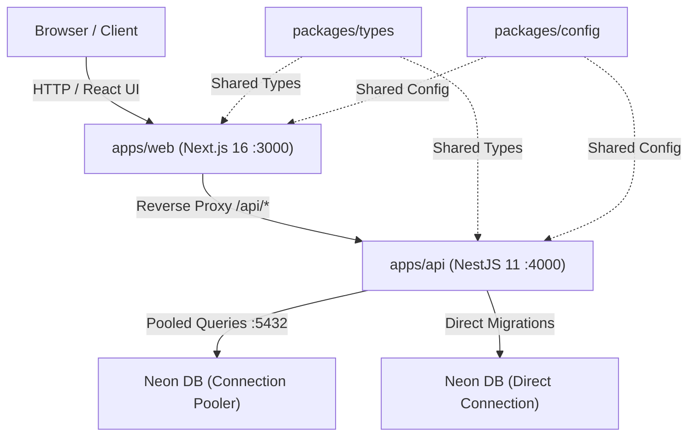

# System Architecture

## Overview

Liftup is structured as a high-performance **pnpm + Turborepo monorepo** designed for full-stack scalability. It separates frontend delivery, backend RESTful business logic, and shared package utilities while maintaining tight type safety and optimized developer ergonomics.

---

## Monorepo Layout

```
liftup/
├── apps/
│   ├── web/                     # Next.js 16 (React 19, Tailwind CSS v4, shadcn/ui) [@liftup/web]
│   └── api/                     # NestJS 11 (Modular REST API, Prisma, Neon DB) [@liftup/api]
├── packages/
│   ├── types/                   # Shared TypeScript interfaces & DTOs [@liftup/types]
│   ├── config/                  # Shared base tsconfig and compiler settings [@liftup/config]
│   └── eslint-config/           # Monorepo linting standards [@liftup/eslint-config]
├── docs/                        # Technical & architectural specifications
├── pnpm-workspace.yaml          # pnpm workspace definition
├── turbo.json                   # Turborepo task pipeline & caching
└── package.json                 # Monorepo root orchestration
```

---

## Component Roles & Communication



### 1. Web Application (`apps/web`)

- Built on **Next.js 16 App Router** with React 19 and Tailwind CSS v4.
- Uses `shadcn/ui` and `@base-ui/react` primitives.
- Configured with a reverse proxy in `next.config.ts` mapping all `/api/*` requests directly to `http://localhost:4000/api/*`, eliminating CORS friction during local development.

### 2. Backend API (`apps/api`)

- Built with **NestJS 11** using modern ESM and TypeScript.
- Follows modular architectural patterns (`PrismaModule`, `HealthModule`, domain resource modules).
- Integrates Prisma ORM for database interaction with Neon PostgreSQL.

### 3. Shared Packages (`packages/*`)

- **`@liftup/types`**: Type definitions, API response shapes (`ApiResponse<T>`), health interfaces (`HealthStatus`), and domain models shared across client and server.
- **`@liftup/config`**: Base TypeScript compiler configurations (`tsconfig.base.json`, `tsconfig.react.json`, `tsconfig.node.json`).
- **`@liftup/eslint-config`**: Standardized ESLint rules for Node, Next.js, and NestJS environments.

---

## Turborepo Pipeline

Turborepo handles task orchestration, dependency tracking, and remote/local caching:

- `pnpm dev`: Runs both `apps/web` and `apps/api` in parallel with interactive logs.
- `pnpm build`: Runs topological builds across shared packages, `apps/api`, and `apps/web`.
- `pnpm test`: Executes Vitest test suites.
- `pnpm lint`: Runs ESLint / Oxlint checks across the codebase.
